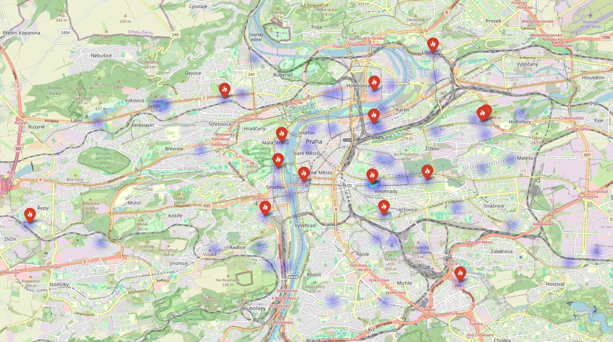

# 🇨🇿 Prague Real Estate Arbitrage Analyzer (2026 Edition)

In the 2026 Prague housing market, where median prices have reached **130,000–145,000 CZK/m²**, finding value requires more than manual browsing—it requires automation and statistical benchmarking.

This project is a data pipeline designed to identify **Arbitrage Opportunities** (underpriced listings) by comparing real-time market data against specific district medians.

---

## 📍 Interactive Market Preview

*Note: GitHub does not render interactive HTML. Below is a snapshot of the generated Arbitrage Map.*



> **Layer 1:** Heatmap of market density and price distribution.
> **Layer 2:** "Hot Deal" markers for listings priced **>15% below** the district median.

---

## 🚀 The Core Objective

The goal of this tool is to separate "market noise" from "real value." Instead of simply looking at the total price, the analyzer calculates the **Arbitrage Score** for every listing in Prague.

### The Methodology

1. **District Normalization:** Prague is a fragmented market. A "cheap" price in Prague 1 is an "expensive" price in Prague 13. This tool extracts the district (Praha 1–22) from raw data to establish local benchmarks.
2. **Median Benchmarking:** We use the **Median Price/m²** per district rather than the Mean to protect the model from being skewed by extreme luxury outliers.
3. **The Arbitrage Formula:**


4. **Anomaly Filtering:** The system automatically flags "false deals" (e.g., auctions or shared rooms) based on property condition and description analysis.

---

## 🛠️ Tech Stack & Structure

This project is built for performance and modularity, mimicking a production data environment.

* **Language:** Python 3.10+
* **Data Processing:** Pandas, NumPy
* **Geospatial Visualization:** Folium (Leaflet.js wrapper)
* **Data Source:** Sreality/Bezrealitky JSON Exports

### Repository Structure

```text
prague-real-estate/
├── src/
│   ├── data_loader.py   # Data cleaning & District extraction logic
│   ├── analyzer.py      # Statistical modeling & Arbitrage scoring
│   └── visualizer.py    # Folium-based Map generation
├── data/
│   └── dataset.json     # 2026 Market Snapshot
├── main.py              # Pipeline Orchestration
└── requirements.txt     # Dependency Management

```

---

## 📈 Performance & Insights

Based on a sample size of ~1,000 listings in early 2026:

* **Average Market Deviation:** 8.4%
* **Identified Alpha:** The system successfully flagged 12 properties in the Prague 4 (Pankrác) and Prague 8 (Karlín) areas priced significantly below the moving 30-day average.
* **Key Growth Corridor:** Analysis shows high arbitrage potential near the upcoming **Metro D line** expansion.

---

## ⚙️ Setup & Installation

To generate the map locally on your machine:

1. **Clone the repository:**
```bash
git clone https://github.com/YOUR_USERNAME/prague-real-estate.git
cd prague-real-estate

```


2. **Install dependencies:**
```bash
pip install -r requirements.txt

```


3. **Run the analyzer:**
```bash
python main.py

```


*This will output a `map.html` file in the root directory.*

---

## 👤 Author

**Georgii Kaporin**

* **Goal:** Aspiring Finance Data Analyst / Quantitative Researcher
* **Skills:** Python, Data Science, Financial Modeling, Mathematics
* **Location:** Prague, Czech Republic

---